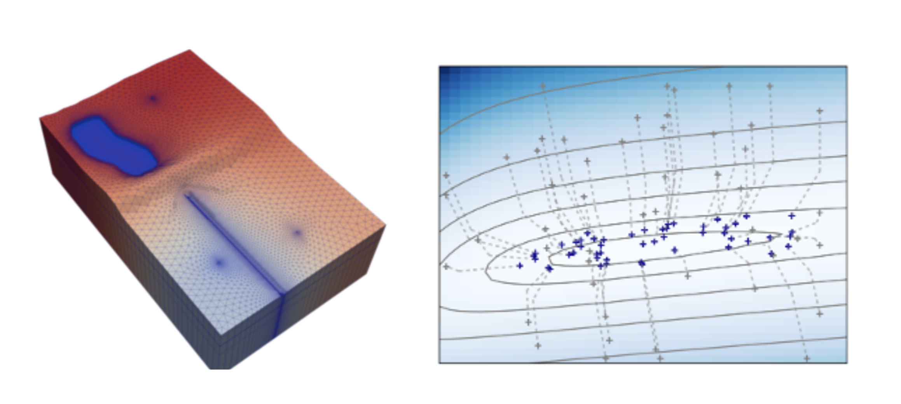

# MODFLOW-Madison2025

# Advanced Groundwater Modeling Techniques with MODFLOW 6 and PEST++: A 2-day informal in-person workshop

## Background Information

Day 1 course materials for MODFLOW 6/PEST++ workshop in Madison, WI, July 2025

Instructors: Joe Hughes and Chris Langevin

Where: USGS office, Madison, WI

When: July 21, 2025, 8am-5pm with lunch and coffee breaks (PEST++ is the following day)

Cost: $50; payment instructions located [here](https://sspa.com/news-events/)

Registration: https://forms.gle/o5Yn6fjgRAToBQ6w8

# Agenda

* Introductions and Overview
* Checking your installation
* Overview of MODFLOW 6
* Brief introduction to FloPy
* Structured and unstructured grids (DIS, DISV, DISU) and LGR
* Transport
  * Particle tracking - PRT
  * Solute transport - GWT
  * Energy transport - GWE
  * Variable density groundwater flow and transport
* Extended MODFLOW 6 - parallel, netcdf/ugrid
* MODFLOW API demonstration
* Surface Water Flow (SWF) demonstration

## Software

We will be using Jupyter notebooks to run live demonstrations of the agenda topics.  If you would like to follow along on your laptop, software installation instructions are included [here](./software.md).
