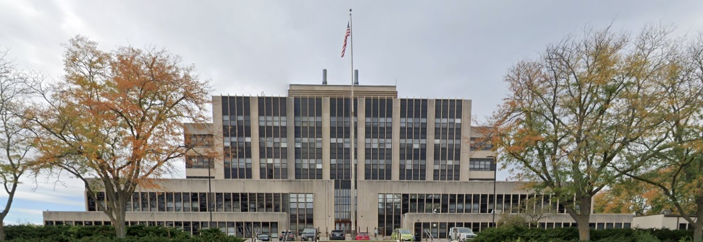

# MODFLOW-Madison2025

# Advanced Groundwater Modeling Techniques with MODFLOW 6 and PEST++: A 2-day informal in-person workshop

## Background Information

Day 1 course materials for MODFLOW 6/PEST++ workshop in Madison, WI, July 2025

Instructors: Joe Hughes and Chris Langevin

Where: USGS office, Madison, WI

When: July 21, 2025, 8am-5pm with lunch and coffee breaks (PEST++ is the following day)

Cost: $50; payment instructions located [here](https://sspa.com/news-events/)

Registration: https://forms.gle/o5Yn6fjgRAToBQ6w8

# Agenda

* Welcome (Mike, Chris, Joe)
* Checking your installation (Joe)
* Overview of MODFLOW 6 (Chris)
* Brief introduction to FloPy (Joe)
* Structured and unstructured grids (DIS, DISV, DISU) and LGR (Chris)
* Transport
  * Particle tracking - PRT (Joe)
  * Solute transport - GWT (Chris)
  * Energy transport - GWE (Chris)
  * Variable density groundwater flow and transport (Chris)
* Extended MODFLOW 6 - parallel, netcdf/ugrid (Joe)
* MODFLOW API demonstration (Joe)
* Surface Water Flow (SWF) demonstration (Chris)
* Wrap up

## Software

We will be using Jupyter notebooks to run live demonstrations of the agenda topics.  If you would like to follow along on your laptop, software installation instructions are included [here](./software.md).
